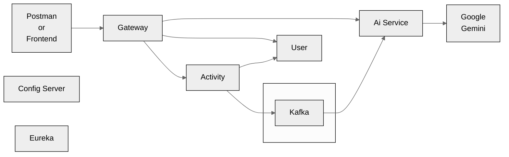

# 🏋️‍♂️ Fitness Web Application – Microservices & AI Powered

A **production-ready fitness tracking web application** built using **Spring Boot Microservices** and **React**, featuring **secure OAuth2 authentication**, **event-driven AI analytics**, and **scalable cloud-native architecture**.

---

## 📌 Description 

This project demonstrates a **real-world microservices architecture** where user fitness activities are collected, processed asynchronously, and analyzed by an AI engine to generate personalized recommendations.  
It showcases **secure API design, service discovery, centralized configuration, asynchronous messaging, and modern frontend practices**.

---

## 🧠 Key Highlights

- ✅ Microservices architecture using **Spring Cloud**
- 🔐 OAuth2 Authorization Code Flow with **PKCE (Keycloak)**
- ⚡ Asynchronous AI processing using **Kafka**
- 🧩 Polyglot persistence (**PostgreSQL + MongoDB**)
- 🌐 Centralized API Gateway & Service Discovery
- 🤖 AI recommendations using **Google Gemini**
- 🎨 Modern frontend with **React + Redux Toolkit**

---

## 🏗️ System Architecture



### Architecture Flow Explanation

1. **Frontend / Postman**
   - Sends secured requests via API Gateway

2. **API Gateway**
   - Central entry point for all services
   - Handles authentication, authorization, routing
   - Integrated with **Eureka Service Discovery**

3. **User Service**
   - Manages user registration & profile
   - Stores data in **PostgreSQL**
   - Uses **UUID** as primary identifier

4. **Activity Service**
   - Records user fitness activities
   - Stores data in **MongoDB**
   - Validates user existence via User Service

5. **Kafka**
   - Enables asynchronous communication
   - Sends activity data to AI Service

6. **AI Service**
   - Consumes fitness data from Kafka
   - Integrates with **Google Gemini**
   - Generates analytical fitness recommendations

7. **Config Server**
   - Centralized configuration management
   - Stores `application.yml` for all services

8. **Eureka Server**
   - Registers all microservices
   - Enables service-to-service communication using service names

---

## 🔐 Security Architecture

- OAuth2 Authorization Code Flow with **PKCE**
- Authentication & token management via **Keycloak**
- Token interception and refresh handled on frontend
- Secure inter-service communication

---

## 🔄 Communication Patterns

| Type | Technology |
|-----|------------|
| Synchronous | REST APIs |
| Asynchronous | Kafka Topics |

---

## 🛠️ Backend Tech Stack

- Spring Boot
- Spring Cloud Gateway
- Spring Cloud Config
- Eureka Server
- Kafka
- PostgreSQL
- MongoDB
- Google Gemini AI
- RESTful APIs

---

## 🌐 Frontend Tech Stack

- React (SPA)
- Redux Toolkit
- Material UI
- Axios (Request & Token Interceptors)
- react-oauth2-code-pkce

---

## 📦 Core Features

- User registration & secure login
- Fitness activity tracking
- AI-generated fitness insights
- Centralized API routing
- Event-driven architecture
- Scalable and maintainable design

---

## 🚀 Clone Project

```bash
git clone https://github.com/manavdav/fitness-webApp-microservices.git
```
⚠️ Each microservice has its own configuration and must be started individually or via Docker (if configured).

## 🎯 Why This Project Matters 

Demonstrates enterprise-level architecture

Shows understanding of distributed systems

Implements real authentication flows

Uses AI + event-driven design

Clean separation of concerns

Production-oriented approach

## 👨‍💻 Author

**Manav Dave**
Aspiring Software Developer | Microservices | AI-Driven Applications

